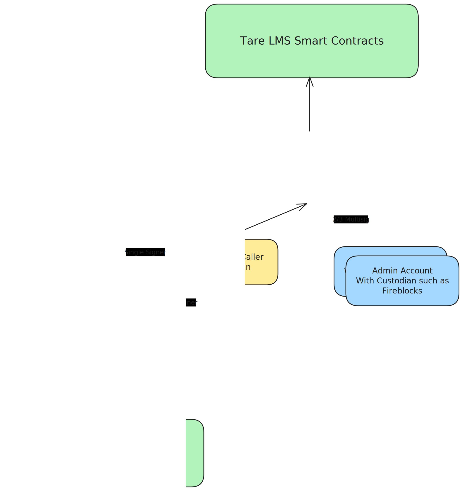

# Smart Accounts Specification

## Overview

A factory contract that deploys Safe smart account wallets with deterministic addresses and automatic installation of the TrustedCalls module, plus configuration of the TrustedSpender contract. The factory exposes a single comprehensive `deploySmartAccount` function that handles all deployment and configuration steps internally, creating fully configured Safes with delegates, currency approvals, NFT collection approvals, trusted recipients, and final ownership structure in one atomic operation.



## Core Concepts

We use a standard Safe which is securing billions in value on blockchains today at the core and only make minimal extensions to introduce some trusted actions that circumvent the multisig for ease of use.

There are two extensions we use:

- **Trusted Calls Module**: A Safe module allowing delegates to call on behalf of the account a limited set of trusted functions without a multisig transaction (see trusted-calls.md). This is installed as a Safe module.
- **Trusted Spender Contract**: A standalone contract allowing delegates to withdraw funds to a set of pre-approved addresses such as a fiat on/off ramp (see trusted-spender.md). This is NOT a Safe module - it operates via standard ERC20 token approvals.

We have our own deployment factory that sets up Safes with the TrustedCalls module enabled and configures token approvals for the TrustedSpender contract, along with delegate and allowance configuration for both.

### Initial configuration of the Safe

The following arguments should be passed into the deploySmartAccount function:

- List of delegates
- Currencys for allowances
- List of ERC721 collection addresses to pre-approve for TrustedSpender (via `setApprovalForAll`)
- List of trusted recipient addresses
- Validity timestamp for TrustedSpender allowances
- Signers for the Safe
- Threshold

From those arguments, the Safe is deployed as follows:

1. Prepare a delegatecall to the factory's configureSmartAccount function with all parameters
2. Create the Safe with final owners and threshold from the start
3. Execute the delegatecall during Safe.setup() to:
   - configureSmartAccount(delegates, currencies, nftCollections, trustedRecipients, validUntil)

   This function executes in the Safe's context and:
   - Enables TrustedCallsModule
   - Approves each currency for TrustedSpender contract with unlimited allowance (standard ERC20 approve)
   - Calls `setApprovalForAll(trustedSpender, true)` on each NFT collection so TrustedSpender can transfer any tokenId in that collection on behalf of the Safe
   - Adds each delegate to TrustedCallsModule (as a module delegate)
   - Adds each delegate to TrustedSpender contract (as a spending delegate)
   - Sets unlimited allowances for each trusted recipient with each currency in TrustedSpender, using the provided `validUntil` timestamp

   NFT per-route allowances (`setNFTAllowance`) are **not** seeded at construction time; they are configured lazily by the Safe or by a guardian once the recipient routes are known.

## Data Structures

```solidity
contract SmartAccountFactory {
    // Immutable references to Safe infrastructure
    SafeProxyFactory public immutable safeProxyFactory;
    address public immutable safeSingleton;

    address public immutable trustedCallsModule;
    address public immutable trustedSpender;

    // Per-factory nonce for deterministic addresses
    uint256 private nonce;
}
```

### Dependencies

The factory relies on Safe smart account infrastructure:

- `SafeProxyFactory`: Creates proxy contracts
- `Safe` singleton: Implementation contract for all proxies
- `SafeProxy`: Minimal proxy contract that delegates to singleton
- `TrustedCallsModule`: Module for delegated transaction execution
- `TrustedSpender`: Contract for delegated fund transfers to approved addresses (not a module, uses token approvals)

## Core Functions

### deploySmartAccount (Main Deployment Function)

```solidity
function deploySmartAccount(
    address[] memory delegates,
    address[] memory currencies,
    address[] memory nftCollections,
    address[] memory trustedRecipients,
    uint48 validUntil,
    address[] memory owners,
    uint256 threshold
) external returns (address)
```

**Purpose**: Deploy a fully configured Safe with both modules and initial settings

**Parameters**:

- `delegates`: Array of delegate addresses for both modules
- `currencies`: Array of token addresses to approve for TrustedSpender
- `nftCollections`: Array of ERC721 collection addresses on which the Safe should call `setApprovalForAll(trustedSpender, true)` so TrustedSpender can move any tokenId in those collections on behalf of the Safe. NFT per-route allowances themselves must still be set separately via `TrustedSpender.setNFTAllowance`.
- `trustedRecipients`: Array of addresses that can receive funds via TrustedSpender
- `validUntil`: Timestamp until which TrustedSpender allowances are valid. Must be strictly greater than `block.timestamp` (reverts `InvalidAllowanceDeadline` otherwise). Use `type(uint48).max` for effectively no expiry.
- `owners`: Array of final owner addresses for the Safe
- `threshold`: Final threshold for owner signatures

**Implementation Overview**:
The function uses a single delegatecall to configure the Safe during initialization:

1. **Encode Configuration Call**:
   - Create a delegatecall to factory's configureSmartAccount function
   - Pass delegates, currencies, trustedRecipients, and validUntil as parameters

2. **Deploy Safe with Final Configuration**:
   - Deploy with final owners and threshold from the start
   - Pass factory address as `to` in Safe.setup() for delegatecall
   - Pass configuration call as `data` in Safe.setup()
   - All configuration executes atomically during initialization

3. **Record Provenance**:
   - The deployed Safe address is recorded in the `isDeployedSmartAccount` registry

**Benefits of This Approach**:

- True atomic deployment - everything in one transaction
- Safe has final owners from the start - no owner swapping
- More gas efficient - no separate transactions or unnecessary batching
- Cleaner implementation - no temporary states
- Reduced attack surface - no window with deployer as owner
- Simpler - no need for MultiSend when there's only one call

### predictSmartAccountAddress

```solidity
function predictSmartAccountAddress(
    address deployer,
    uint256 _nonce,
    address[] memory delegates,
    address[] memory currencies,
    address[] memory nftCollections,
    address[] memory trustedRecipients,
    uint48 validUntil,
    address[] memory owners,
    uint256 threshold
) external view returns (address)
```

**Purpose**: Calculate deployment address before deployment

**Parameters**:

- `deployer`: Address that will deploy the account
- `_nonce`: Nonce value that will be used
- `delegates`: Same delegate addresses that will be passed to `deploySmartAccount`
- `currencies`: Same currency addresses that will be passed to `deploySmartAccount`
- `nftCollections`: Same NFT collection addresses that will be passed to `deploySmartAccount`
- `trustedRecipients`: Same trusted recipient addresses that will be passed to `deploySmartAccount`
- `owners`: Same owner addresses that will be passed to `deploySmartAccount`
- `threshold`: Same threshold that will be passed to `deploySmartAccount`

**Behavior**:

- Reconstructs the full Safe `setup` initializer from the provided parameters
- Computes salt from `keccak256(initializer)` and the deployer/nonce pair, matching SafeProxyFactory's salt derivation
- Calculates CREATE2 address using factory address, salt, and bytecode hash
- Returns predicted address

**Note**: All deployment parameters affect the predicted address because SafeProxyFactory incorporates `keccak256(initializer)` into the CREATE2 salt.

### isDeployedSmartAccount

```solidity
function isDeployedSmartAccount(address account) external view returns (bool deployed)
```

**Purpose**: On-chain provenance check — lets integrators and users verify that a Safe account was deployed by this factory (i.e. belongs to the TARE platform)

**Behavior**:

- Returns `true` only for accounts deployed via `deploySmartAccount` on this factory instance
- Returns `false` for any other address, including predicted-but-not-yet-deployed addresses
- The registry is append-only: entries are never removed

## Implementation Details

### Salt Generation

```solidity
uint256 saltNonce = uint256(keccak256(abi.encodePacked(msg.sender, nonce++)));
```

- Combines deployer address with incrementing nonce
- Ensures unique addresses for same deployer
- Nonce auto-increments with each deployment

### Internal Deployment Sequence

The `deploySmartAccount` function uses a simplified approach with a single delegatecall:

#### Step 1: Prepare Configuration Call

```solidity
// Encode a delegatecall to configureSmartAccount with all parameters
bytes memory configureData = abi.encodeWithSignature(
    "configureSmartAccount(address[],address[],address[],address[],uint48)",
    delegates,
    currencies,
    nftCollections,
    trustedRecipients,
    validUntil
);
```

The `configureSmartAccount` function executes in the Safe's context and handles all configuration:

```solidity
function configureSmartAccount(
    address[] memory delegates,
    address[] memory currencies,
    address[] memory nftCollections,
    address[] memory trustedRecipients,
    uint48 validUntil
) external {
    // 1. Enable TrustedCalls module
    IModuleManager(payable(address(this))).enableModule(trustedCallsModule);

    // 2. Approve currencies for TrustedSpender (standard ERC20 approvals)
    for (uint256 i = 0; i < currencies.length; i++) {
        IERC20(currencies[i]).forceApprove(trustedSpender, type(uint256).max);
    }

    // 3. Approve NFT collections for TrustedSpender (collection-wide setApprovalForAll)
    for (uint256 i = 0; i < nftCollections.length; i++) {
        IERC721(nftCollections[i]).setApprovalForAll(trustedSpender, true);
    }

    // 3. Add delegates to both TrustedCalls module and TrustedSpender contract
    for (uint256 i = 0; i < delegates.length; i++) {
        // Add to TrustedCalls module
        ITrustedCalls(trustedCallsModule).addDelegate(address(this), delegates[i]);

        // Add to TrustedSpender contract
        ITrustedSpender(trustedSpender).addDelegate(address(this), delegates[i]);
    }

    // 4. Set allowances for trusted recipients in TrustedSpender
    for (uint256 i = 0; i < trustedRecipients.length; i++) {
        for (uint256 j = 0; j < currencies.length; j++) {
            ITrustedSpender(trustedSpender).setAllowance(
                currencies[j],
                address(this),
                trustedRecipients[i],
                type(uint208).max,
                validUntil
            );
        }
    }
}
```

#### Step 2: Deploy Safe with Everything Configured

```solidity
// Create Safe with final owners and execute configuration during setup
bytes memory initializer = abi.encodeWithSelector(
    Safe.setup.selector,
    owners,              // final owners from the start
    threshold,           // final threshold
    address(this),       // to: factory contract for delegatecall
    configureData,       // data: configuration call
    address(0),          // fallbackHandler
    address(0),          // paymentToken
    0,                   // payment
    address(0)           // paymentReceiver
);

// Deploy proxy with full configuration
uint256 saltNonce = uint256(keccak256(abi.encodePacked(msg.sender, nonce++)));

SafeProxy proxy = safeProxyFactory.createProxyWithNonce(
    safeSingleton,
    initializer,
    saltNonce
);

// Safe is now fully configured with:
// - Final owners and threshold
// - TrustedCalls module enabled
// - All delegates added
// - All currencies approved
// - All allowances set
```

### Configuration Function

The contract has a comprehensive configuration function that is called via DELEGATECALL during Safe setup:

```solidity
function configureSmartAccount(
    address[] memory delegates,
    address[] memory currencies,
    address[] memory nftCollections,
    address[] memory trustedRecipients
) external {
    // Executes in Safe's context via delegatecall
    // address(this) is the Safe address
    // Handles all module enabling, approvals, and configurations
}
```

This approach solves the address prediction problem by executing all configuration in the Safe's context, eliminating the need to know the Safe address beforehand.

### Address Prediction Formula

```solidity
address = keccak256(
    0xff,
    factory_address,
    salt,
    keccak256(deployment_bytecode)
)
```

- Standard CREATE2 address calculation
- Deployment bytecode includes proxy code + singleton address

## Events

```solidity
event SmartAccountDeployed(
    address indexed account,
    address indexed deployer,
    address[] owners,
    uint256 threshold
);
```

This event is emitted when a new Smart Account is deployed.

## Example Usage

### Complete Deployment Example

```solidity
// Configure delegates
address[] memory delegates = new address[](2);
delegates[0] = operatorWallet1;
delegates[1] = operatorWallet2;

// Configure currencies to approve
address[] memory currencies = new address[](2);
currencies[0] = USDC;
currencies[1] = DAI;

// Configure ERC721 collections to pre-approve for TrustedSpender (optional)
address[] memory nftCollections = new address[](1);
nftCollections[0] = loansNft;

// Configure trusted recipients (e.g., fiat off-ramps)
address[] memory trustedRecipients = new address[](3);
trustedRecipients[0] = fiatOfframp1;
trustedRecipients[1] = fiatOfframp2;
trustedRecipients[2] = vendorPaymentAddress;

// Configure final owners
address[] memory owners = new address[](3);
owners[0] = alice;
owners[1] = bob;
owners[2] = charlie;

// Deploy with full configuration
address safe = factory.deploySmartAccount(
    delegates,
    currencies,
    nftCollections,
    trustedRecipients,
    type(uint48).max,  // no expiry for allowances
    owners,
    2  // 2-of-3 multisig threshold
);

// Safe is now fully configured with:
// - Both modules enabled
// - Delegates can execute trusted calls
// - Delegates can transfer to trusted recipients
// - USDC and DAI approved for TrustedSpender
// - Final owners and threshold set
```

### Predict Deployment Address

```solidity
// Predict address before deployment (must pass same params as deploySmartAccount)
address predicted = factory.predictSmartAccountAddress(
    msg.sender,        // deployer
    0,                 // nonce (first deployment)
    delegates,
    currencies,
    nftCollections,
    trustedRecipients,
    validUntil,
    owners,
    threshold
);

// Deploy account with same nonce
address safe = factory.deploySmartAccount(
    delegates,
    currencies,
    nftCollections,
    trustedRecipients,
    validUntil,
    owners,
    threshold
);

// Verify prediction
assert(predicted == safe);
```

### Deploy Multiple Accounts

```solidity
// Same deployer can create multiple accounts
// Each gets unique address due to incrementing nonce

address safe1 = factory.deploySmartAccount(
    delegates1,
    currencies1,
    nftCollections1,
    trustedRecipients1,
    type(uint48).max,
    owners1,
    threshold1
);  // nonce = 0

address safe2 = factory.deploySmartAccount(
    delegates2,
    currencies2,
    nftCollections2,
    trustedRecipients2,
    type(uint48).max,
    owners2,
    threshold2
);  // nonce = 1

assert(safe1 != safe2);  // Different addresses
```

### Post-Deployment Operations

```solidity
// After deployment, delegates can perform both types of operations:

// 1. Execute trusted calls via TrustedCallsModule
vm.prank(operatorWallet1);
trustedCallsModule.executeTrustedCall(
    safe,
    loansContract,
    abi.encodeWithSignature("recordPayment(uint256,uint256)", loanId, amount)
);

// 2. Transfer funds to trusted recipients via TrustedSpender
vm.prank(operatorWallet1);
trustedSpenderModule.executeTransfer(
    USDC,              // currency
    safe,              // from
    fiatOfframp1,      // to (trusted recipient)
    1000e6             // amount (1000 USDC)
);

// 3. Owners retain full control for non-delegated operations
// Requires 2-of-3 signatures for this example
bytes memory signatures = abi.encodePacked(aliceSig, bobSig);
safe.execTransaction(
    arbitraryContract,
    value,
    arbitraryData,
    Enum.Operation.Call,
    // ... other params
    signatures
);
```

## Error Handling

### Custom Errors

```solidity
error InvalidThreshold();        // Threshold is 0
error NoOwners();                // Empty owners array
error ThresholdTooHigh();        // Threshold > owners.length
```

## Security Considerations

### Delegatecall-Only Execution

`configureSmartAccount` must only execute via delegatecall from a Safe during initialization. At runtime, `address(this)` is compared against `__self` (the factory's own address): if they match, the call is direct and reverts with `NotDelegateCall`.

### One-Time Configuration

A Safe must not be re-configured after initial setup. If an attacker gained multisig control, they could delegatecall into `configureSmartAccount` to inject new delegates or trusted recipients.

To prevent this, the function writes a sentinel value to a dedicated storage slot (`keccak256("Tare.SmartAccountFactory.configured")`) in the Safe's storage on first execution. Subsequent calls find the slot already set and revert with `AlreadyConfigured`.

## Deployment Architecture

### Contract Dependencies

1. **Safe Singleton**: Master implementation contract
2. **SafeProxyFactory**: Creates proxy contracts
3. **TrustedCallsModule**: Module for delegated transaction execution
4. **TrustedSpender**: Contract for delegated fund transfers (not a module)
5. **SmartAccountFactory**: User-facing deployment interface

### Deployment Order

```
1. Deploy Safe singleton
2. Deploy SafeProxyFactory
3. Deploy TrustedCallsModule
4. Deploy TrustedSpender
5. Deploy SmartAccountFactory(proxyFactory, singleton, trustedCallsModule, trustedSpender)
```

### Constructor Parameters

```solidity
constructor(
    address _safeProxyFactory,
    address _safeSingleton,
    address _trustedCallsModule,
    address _trustedSpender
) {
    safeProxyFactory = SafeProxyFactory(_safeProxyFactory);
    safeSingleton = _safeSingleton;
    trustedCallsModule = _trustedCallsModule;
    trustedSpender = _trustedSpender;
}
```

### CreateX Integration

The deployment script uses CreateX for deterministic cross-chain addresses:

- Same addresses across different networks
- Predictable deployment addresses
- Simplified multi-chain deployments

## Testing Requirements

### Unit Tests

- Test `deploySmartAccount` with various parameter combinations
- Validate all error conditions (empty arrays, invalid thresholds)
- Test nonce incrementing across multiple deployments
- Verify address prediction matches actual deployment
- Test event emissions for each configuration step
- Verify all modules are enabled correctly
- Test delegate configuration for both modules
- Verify currency approvals are set
- Test allowance configurations

### Integration Tests

- Deploy and interact with Safe
- Verify both modules enabled during deployment
- Test TrustedCallsModule delegate operations
- Test TrustedSpender delegate operations
- Verify currency approvals are set correctly
- Verify allowances for trusted recipients
- Test delegate configuration for both modules
- Verify final owner and threshold updates
- Test complete deployment flow end-to-end

### Edge Cases

- Single owner Safe with multiple delegates
- Maximum threshold (all owners required)
- Empty delegates array (no initial delegates)
- Multiple currencies and recipients combinations
- Large number of delegates requiring gas optimization
- Multiple deployments by same address
- Different deployers with same configuration
- Safe with only one currency and one recipient
- Deployment with maximum parameters hitting gas limit

## Gas Optimization

### Current Optimizations

- Uses proxy pattern to minimize deployment cost
- Singleton pattern shares logic across all Safes
- Minimal proxy bytecode

### Potential Improvements

- Batch deployment of multiple Safes
- Optimized salt generation
- Caching of common configurations

## References

- [Safe Smart Account Documentation](https://docs.safe.global/learn/safe-core/safe-core-protocol/safe-contracts)
- [Safe Proxy Factory](https://github.com/safe-global/safe-contracts/blob/main/contracts/proxies/SafeProxyFactory.sol)
- [CREATE2 Opcode](https://eips.ethereum.org/EIPS/eip-1014)
